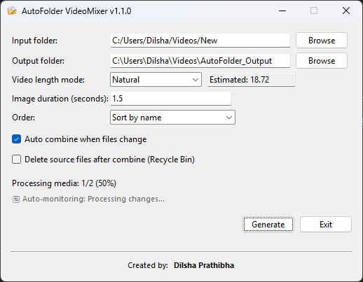

# 🎬 AutoFolder VideoMixer

[](https://github.com/DilshaPrathibha/AutoFolder-VideoMixer/releases/latest)
[](https://github.com/DilshaPrathibha/AutoFolder-VideoMixer/releases)
[](https://github.com/DilshaPrathibha/AutoFolder-VideoMixer)

AutoFolder VideoMixer is a **Windows desktop application** that automatically converts and combines **videos and images from a folder into a single MP4 video**.  
It is designed for fast, repeatable video creation without manual editing.

Perfect for content creators, automation workflows, digital signage, and batch video generation.

---

## � Application Interface

<p align="center">
  
</p>

*AutoFolder VideoMixer v1.1.0 - Clean, intuitive interface with custom icon and smart video length mode*

---

## �📥 Download

**[⬇️ Download Latest Release (v1.1.0)](https://github.com/DilshaPrathibha/AutoFolder-VideoMixer/releases/latest)**

### Quick Install:
1. Download `AutoFolder-VideoMixer-v1.1.0-Windows.zip`
2. Extract the ZIP file
3. Run `AutoFolder-VideoMixer.exe`
4. That's it! No installation needed.

**Requirements:** Windows 10/11 (64-bit)

---

## ✨ Features

- 📁 Combine **videos + images** from a folder
- 🖼️ Convert images into video clips with custom duration
- 🎞️ Normalize all media to:
  - 1280×720 resolution
  - 30 FPS
  - MP4 (H.264, yuv420p)
- 🔄 Loop media to reach a **fixed video length**
- ▶️ Or combine media **once until it naturally ends**
- 🔀 Sort media by:
  - Name
  - Date (newest / oldest)
  - Random order
- 👀 **Auto-watch folder** and regenerate video when files change
- 🗑️ Optional **safe deletion** of source files (Recycle Bin)
- 📊 Live progress display
- 🖱️ Simple, lightweight Tkinter GUI
- 🎨 **Custom application icon** for professional appearance
- 🔄 **Smart video length mode** with dropdown selection:
  - Natural mode: Combine until media ends
  - Custom mode: Set specific video duration
- 💬 **Auto-monitoring status indicator** shows when background monitoring is active
- ⚠️ **Warning dialog** for file deletion with "Don't show this warning again" option
- 📏 **On-demand duration calculation** - Click to calculate estimated video length

---

## 🧠 How It Works (User View)

1. Select an **input folder** with images and videos  
2. Select an **output folder**
3. Choose **Video length mode** from dropdown:
   - **Natural**: Combine until media ends (no looping)
   - **Custom**: Enter specific duration in minutes (media loops to fill)
4. Set image duration (seconds)
5. Choose media order
6. Click **Generate**
7. Get a ready-to-use MP4 video

No timeline editing. No manual cuts. Just drop files and go.

---

## 📂 Supported Formats

### Videos
- MP4
- MOV
- AVI
- MKV
- WEBM
- M4V

### Images
- JPG / JPEG
- PNG
- WEBP

---

## ⚙️ Requirements

- **Windows 10/11**
- **Python 3.8+** (for running from source)
- **FFmpeg (Full Build)**  
  - Download: https://ffmpeg.org/download.html
  - Either add to system PATH or place in `bin/` folder
- Python packages:
  ```bash
  pip install send2trash
  ```

---

## 🚀 Installation

### Option 1: Download Pre-built Executable (Easiest)
1. Go to [Releases](https://github.com/DilshaPrathibha/AutoFolder-VideoMixer/releases)
2. Download `AutoFolder-VideoMixer-v1.1.0-Windows.zip`
3. Extract and run `AutoFolder-VideoMixer.exe`
4. FFmpeg is already bundled - no additional setup needed!

### Option 2: Run from Source
1. **Clone the repository**:
   ```bash
   git clone https://github.com/DilshaPrathibha/AutoFolder-VideoMixer.git
   cd AutoFolder-VideoMixer
   ```

2. **Install dependencies**:
   ```bash
   pip install send2trash
   ```

3. **Install FFmpeg**:
   - Download FFmpeg from https://ffmpeg.org/download.html
   - Add to system PATH, or place `ffmpeg.exe` and `ffprobe.exe` in a `bin/` folder

4. **Run the application**:
   ```bash
   python src/AutoFolder.py
   ```

---

## 📖 Usage

1. **Launch** the application
2. **Select input folder** containing your images and videos
3. **Select output folder** for the generated video
4. **Configure settings**:
   - Choose **Video length mode** from dropdown (Natural or Custom)
   - If Custom: Enter video length in minutes
   - Set **Image duration** (how long each image appears, in seconds)
   - Choose **Sort order** (name, date newest/oldest, random)
5. **Optional features**:
   - Enable **Auto combine when files change** to auto-regenerate (requires clicking Generate once first)
   - Enable **Delete source files after combine** to move files to Recycle Bin after processing
6. Click **Generate**
7. Your combined video will be saved as `combined_YYYYMMDD_HHMMSS.mp4`

**Tip:** In Natural mode, click the time input field to calculate estimated video duration!

---

## 💡 Use Cases

- **Social Media Content**: Combine product photos and clips into promotional videos
- **Digital Signage**: Auto-generate slideshow videos from a folder
- **Event Highlights**: Merge photos and videos from events
- **Time-lapse Creation**: Combine sequential images into video
- **Batch Processing**: Automate repetitive video creation tasks
- **Content Automation**: Auto-watch folder for new media and regenerate

---

## 🔧 Configuration

The application automatically detects FFmpeg in:
1. Bundled `bin/` folder (for packaged versions)
2. System PATH
3. Common installation paths: `C:\ffmpeg\bin\`, etc.

Default folders can be modified in the GUI on each run.

---

## 🛠️ Building from Source

Want to create your own executable? See [BUILD.md](BUILD.md) for detailed instructions on:
- Building standalone executables with PyInstaller
- Creating Windows installers with Inno Setup
- Bundling FFmpeg
- Code signing and distribution

---

## ❓ FAQ

**Q: Why is the output video large?**  
A: The app uses H.264 with quality settings optimized for compatibility. Adjust FFmpeg settings in the code for smaller files.

**Q: Can I use other video formats?**  
A: Yes! Add extensions to `VIDEO_EXTS` in the code.

**Q: Does it work on Mac/Linux?**  
A: Currently Windows-only. Mac/Linux support requires path adjustments and FFmpeg binary detection changes.

**Q: How do I change output resolution?**  
A: Modify `TARGET_W`, `TARGET_H`, and `TARGET_FPS` in the code.

**Q: What if FFmpeg is not found?**  
A: The app will show an error on launch. Install FFmpeg and ensure it's in PATH or the `bin/` folder.

---

## 🐛 Troubleshooting

### FFmpeg Not Found
- Ensure FFmpeg is installed and in system PATH
- Or place `ffmpeg.exe` and `ffprobe.exe` in a `bin/` folder next to the application

### Video Generation Fails
- Check that all media files are not corrupted
- Ensure output folder has write permissions
- Check FFmpeg output in console for errors

### Auto-monitoring Not Working
- Ensure you've clicked the "Generate" button at least once first
- Check that "Auto combine when files change" checkbox is enabled
- Ensure input folder exists and is accessible
- Verify that files are being added/removed (not just modified)

---

## 📄 License

This project is provided as-is without a formal license. All rights reserved by the creator.

If you wish to use, modify, or distribute this software, please contact the creator for permission.

---

## 🤝 Contributing

Contributions are welcome! Please:
1. Fork the repository
2. Create a feature branch
3. Make your changes
4. Submit a pull request

---

## 🙏 Acknowledgments

- Built with Python and Tkinter
- Powered by FFmpeg
- Uses `send2trash` for safe file deletion

---

## �‍💻 Creator

**Dilsha Prathibha**

[](https://www.linkedin.com/in/dilshaprathibha/)
[](mailto:dilshaprathibha@gmail.com)

💼 Software Developer | Automation Enthusiast  
📧 dilshaprathibha@gmail.com

Feel free to reach out for questions, suggestions, or collaboration opportunities!

---

## 📬 Support

If you find this project helpful, please:
- ⭐ Star this repository
- 🐛 Report bugs via [GitHub Issues](https://github.com/DilshaPrathibha/AutoFolder-VideoMixer/issues)
- 💡 Suggest features or improvements
- 🤝 Contribute via pull requests

---

**Version**: 1.1.0
